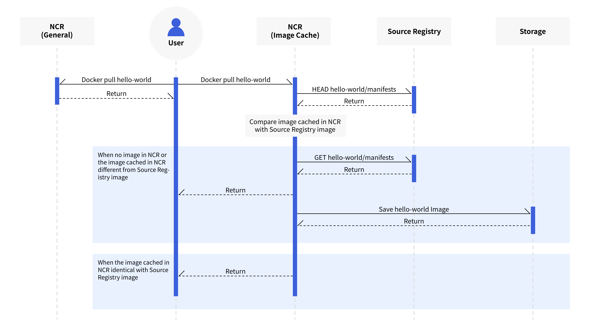

# Console Guide Template(Title)

## (Heading 1) 제목 1

&#x20;(Paragraphs) 해당 서비스에 대한 개요, 설명을 작성합니다.

### (Heading 2) 제목 2

(Paragraphs) 제목 2에 대한 개요, 설명을 작성합니다.

* (Unordered lists) 항목 1 (항목화하여 작성해야 하는 내용을 작성합니다.)
* 항목 2
* 항목 3

(Paragraphs) 설명을 이어 작성합니다.

1. (Ordered lists) 스텝  1 (순서가 있는 동작을 설명할 때 사용합니다.)
2. 스텝 2
3. 스텝 3

(Paragraphs) 설명을 이어 작성합니다.


**알림/알아두기 (Info Hint)**

참고 사항이나 추가 정보를 제공할 때 **알림** 힌트를 사용합니다.



**주의 (Warning Hint)**

서비스 사용 시 사용자가 주의하거나 기억해야 할 정보를 제공할 때 **주의** 힌트를 사용합니다.



**경고 (Danger Hint)**

서비스 사용 시 가이드를 따르지 않을 경우 재산상 손해가 발생할 수 있는 정보를 제공할 때 **경고** 힌트를 사용합니다.


(Paragraphs) 설명을 이어 작성합니다.

(Paragraphs) 설명을 이어 작성합니다.

(Paragraphs) 설명을 이어 작성합니다.

#### (Heading 3) 제목 3

(Paragraphs) 설명을 이어 작성합니다.

<pre class="language-javascript" data-title="index.js" data-overflow="wrap" data-line-numbers><code class="lang-javascript">‌code를 작성합니다.
code를 작성합니다.
code를 작성합니다.

현재 이 코드 블록의 코드는 아래와 같습니다.
<strong>
</strong><strong>code를 작성합니다.
</strong><strong>code를 작성합니다.
</strong><strong>code를 작성합니다.
</strong>

</code></pre>

(Paragraphs) 설명을 이어 작성합니다.

(Paragraphs) 설명을 이어 작성합니다.

(Paragraphs) 하나의 기능에 대해 언어별, OS별로 다른 코드를 제공할 경우 아래와 같이 **Tabs** 기능을 활용해 코드 블록을 표시할 수도 있습니다.



Here are the instructions for Windows



Here are the instructions for macOS



Here are the instructions for Linux



(Paragraphs) 설명을 이어 작성합니다.

(Paragraphs) 본문에 아래와 같이 파일을 직접 다운로드할 수 있도록 첨부할 수도 있습니다.


NHN Cloud 아키텍처 아이콘



**알림/알아두기**

파일은 최대 100MB까지 업로드할 수 있습니다.


#### (Heading 3) 제목 3

(Paragraphs) 설명을 이어 작성합니다.

<figure><figcaption>
Sample Image
</figcaption></figure>


**알림/알아두기**

이미지는 최대 100MB까지 업로드할 수 있습니다.


(Paragraphs) 설명을 이어 작성합니다.

(Paragraphs) 설명을 이어 작성합니다.

(Paragraphs) 설명을 이어 작성합니다.

#### (Heading 3) 제목 3

(Paragraphs) 설명을 이어 작성합니다.

(Paragraphs) Table은 기본 markdown과 동일하게 만들 수 있습니다.

| 제목 1     | 제목 2 | 제목 3 |
| -------- | ---- | ---- |
| **항목 1** |      |      |
| **항목 2** |      |      |
| **항목 3** |      |      |

### (Heading 2) 제목 2

(Paragraphs) 제목 2에 대한 개요, 설명을 작성합니다.

(Paragraphs) **Cards** 기능은 해당 본문과 함께 보면 좋을 페이지를 제공할 때 사용합니다. 이 기능을 통해 정보의 모듈화와 재사용성, 사용자 편의성 등을 강화할 수 있을 것으로 보입니다. 예를 들어 이 페이지가 NHN Cloud의 NHN Kubernetes Service(NKS) 사용 가이드라면 아래와 같은 페이지들을 함께 제공할 수 있습니다.

<table data-view="cards"><thead><tr><th></th><th></th><th></th><th data-hidden data-card-target data-type="content-ref"></th><th data-hidden data-card-cover data-type="files"></th></tr></thead><tbody><tr><td><strong>NHN Kubernetes Service(NKS)</strong></td><td>NHN Kubernetes Service(NKS) 서비스 페이지 바로 가기</td><td></td><td><a href="https://www.nhncloud.com/kr/service/container/nhn-kubernetes-service-nks">https://www.nhncloud.com/kr/service/container/nhn-kubernetes-service-nks</a></td><td><a href=".gitbook/assets/1.png">1.png</a></td></tr><tr><td><strong>NKS: 복제 기능 소개</strong></td><td></td><td>NHN Kubernetes Service(NKS) 기술 문서 살펴보기</td><td><a href="https://meetup.nhncloud.com/posts/329">https://meetup.nhncloud.com/posts/329</a></td><td><a href=".gitbook/assets/1(8).png">1(8).png</a></td></tr><tr><td><strong>KCSP(공인 쿠버네티스 서비스 제공사) 자격 획득</strong></td><td>NHN Kubernetes Service(NKS) 기술 문서 살펴보기</td><td></td><td><a href="https://meetup.nhncloud.com/posts/361">https://meetup.nhncloud.com/posts/361</a></td><td><a href=".gitbook/assets/011rv1.png">011rv1.png</a></td></tr></tbody></table>


**알림/알아두기**

**Cards** 기능은 코드를 제공하지 않기 때문에 개발자가 GitHub에서 직접 작성할 수는 없으며, TW가 문서 엔지니어링 관점, 사용자에  관점에서 필요하다고 판단될 때 사용하면 좋을 것 같습니다.


(Paragraphs) 설명을 이어 작성합니다.

(Paragraphs) 설명을 이어 작성합니다.

(Paragraphs) 설명을 이어 작성합니다.

